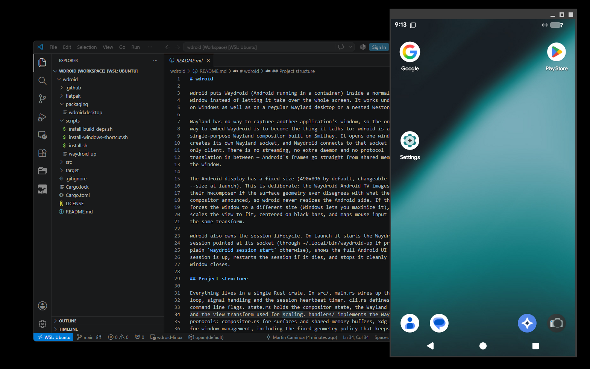

# wdroid

wdroid puts Waydroid (Android running in a container) inside a normal desktop
window instead of letting it take over the whole screen. It works under WSLg
on Windows as well as on a regular Wayland desktop or a nested Weston.

Wayland has no way to capture another application's window, so the only clean
way to embed Waydroid is to become the thing it talks to: wdroid is a small,
single-purpose Wayland compositor built on Smithay. It opens one window,
creates its own Wayland socket, and Waydroid connects to that socket as its
only client. There is no streaming, no extra daemon and no protocol
translation in between — Android's frames go straight from shared memory to
the window.

The Android display has a fixed size (490x896 by default, changeable with
--size at launch). This is deliberate: the Waydroid Android TV images crash
their hwcomposer if the surface geometry ever disagrees with what the
compositor announced, so wdroid never resizes the Android side. If the host
forces the window to a different size (Windows lets you maximize it), wdroid
scales the view to fit, centered on black bars, and maps mouse input through
the same transform.

wdroid also owns the session lifecycle. On launch it starts the Waydroid
session pointed at its socket (through ~/.local/bin/waydroid-up if present,
plain `waydroid session start` otherwise), shows the full Android UI once the
session is up, restarts the session if it dies, and stops it cleanly when the
window closes.

## Project structure

Everything lives in a single Rust crate, in src/: 

- main.rs wires up the event loop, signal handling and the session heartbeat timer.
- cli.rs defines the command line flags.
- state.rs holds the compositor state, the Wayland socket and the view transform used for scaling. 
- handlers/ implements the Wayland protocols: 
    - compositor.rs for surfaces and shared-memory buffers,
    - xdg_shell.rs for window management, including the fixed-geometry policy that keeps the Android side stable,
    - mod.rs for seat, output and clipboard plumbing.
- winit_loop.rs owns the host window and the render pass.
- input.rs translates host input events into Wayland ones.
- focus.rs routes pointer focus between the Android surface and the overlay.
- ui.rs is the small egui overlay that shows session status.
- session.rs is the Waydroid session state machine.

Outside src/:
- scripts/ holds the installers, a copy of the waydroid-up launcher and the
weston-clip-bridge clipboard sync script.
- packaging/ has the desktop entry.
- flatpak/ the Flatpak manifest and its helper scripts.

## Requirements

Building needs a Rust toolchain (rustup is fine) plus build-essential,
pkg-config, libxkbcommon-dev and libegl-dev. Running needs libegl1,
libxkbcommon0 and libgles2, and of course a working Waydroid installation —
wdroid manages Waydroid, it does not replace it. On WSL2 that means the usual
prerequisites: a kernel with binder support and the Android images installed.

## Compiling

Run scripts/install-build-deps.sh once to install the system packages and
rustup, then:

    cargo build --release

The binary ends up in target/release/wdroid.

## Installing

Run scripts/install.sh from the repository root after building. It installs
the runtime libraries (including wl-clipboard for the clipboard path), copies
the binary to ~/.local/bin/wdroid, installs the waydroid-up launcher and the
weston-clip-bridge script only if you do not already have them, creates a desktop
entry (which WSLg republishes as a Windows Start Menu entry), and under WSL
calls scripts/install-windows-shortcut.sh to put a wdroid shortcut on the
Windows desktop. That shortcut launches through wslg.exe, so no terminal
window appears, and logs land in /tmp/wdroid.log.

Each script can also be run on its own if you only want part of the setup.

## Running

Launch wdroid from the desktop entry, the Windows shortcut, or a terminal.
Useful flags: --size WxH picks the Android resolution (fixed for the lifetime
of the process), --socket names the Wayland socket, --no-autostart skips the
session so you can attach test clients like weston-terminal, --launcher
points at a custom session launcher script, and --xkb-layout/--xkb-variant
override the keyboard layout. Closing the window, Ctrl+C or SIGTERM all stop
the Waydroid session before exiting.

The desktop entry and the Windows shortcut both launch wdroid through
`sh -lc`, a login shell, so ~/.profile runs first. Environment that affects
rendering — for example Mesa's GPU selection under WSL (GALLIUM_DRIVER,
MESA_D3D12_DEFAULT_ADAPTER_NAME) — must be exported from ~/.profile;
~/.bashrc is only read by interactive bash and never reaches these
launchers, leaving wdroid on software rendering.

## Clipboard

Copy and paste work across Android, the Linux host and (under WSL) Windows.
Two pieces make this happen:

- The compositor implements the wlr-data-control protocol, so wl-copy and
  wl-paste can read and set the selection on wdroid's socket without needing
  keyboard focus. Waydroid's own session-side clipboard manager (pyclip,
  which shells out to wl-clipboard) uses exactly this to sync the Android
  clipboard with the compositor selection.
- scripts/weston-clip-bridge is a small polling loop that keeps three
  clipboards equal: the Windows clipboard (via powershell.exe), the host
  compositor (wayland-0 under WSLg) and the nested one — it targets
  wdroid's socket when present and falls back to a nested Weston's
  wayland-1, which is where its name comes from. waydroid-up starts it;
  a flock makes repeated starts a no-op. On a plain Linux desktop without
  Windows the bridge still syncs host and Android sides; expect a second
  or two of latency either way, and text only.

## Debian package

The GitHub Action in .github/workflows/build-deb.yml builds a .deb with
cargo-deb on every version tag (v0.1.0 and so on) and attaches it to the
release; it can also be run manually from the Actions tab. To build locally:

    cargo install cargo-deb
    cargo deb

The package installs to /usr/bin/wdroid with a desktop entry, declares the
runtime library dependencies, recommends waydroid and wl-clipboard, and ships
waydroid-up and weston-clip-bridge as examples under
/usr/share/wdroid/examples.

## Flatpak

flatpak/io.github.martin5211.wdroid.yml builds wdroid against the
org.freedesktop.Platform 24.08 runtime, for use on Pop!_OS or any other
distribution with Flatpak. Waydroid itself cannot live inside the sandbox —
the manifest bridges to the host instead: a bundled shim forwards every
waydroid CLI call through flatpak-spawn, and the compositor socket is created
in a host-visible runtime subdirectory so the session can connect to it.
Build and install with:

    flatpak-builder --user --install --force-clean build-dir \
        flatpak/io.github.martin5211.wdroid.yml

Two honest caveats: the manifest builds with network access for cargo (fine
locally, not accepted on Flathub without vendored sources), and it has been
written to spec but not yet exercised on a real Flatpak host, so expect to
adjust details the first time.

## Known limitations

Clipboard sync is text-only and polled (see the Clipboard section). The
cursor theme inside Android is the host cursor. Touch input is not forwarded (the pointer
covers the Android TV UI fine). Rendering is a continuous redraw loop rather
than damage-tracked, which costs some idle CPU. Under WSLg the maximize
button cannot be greyed out — WSLg ignores the Wayland non-resizable hints —
so maximizing simply gives you the scaled view described above.
